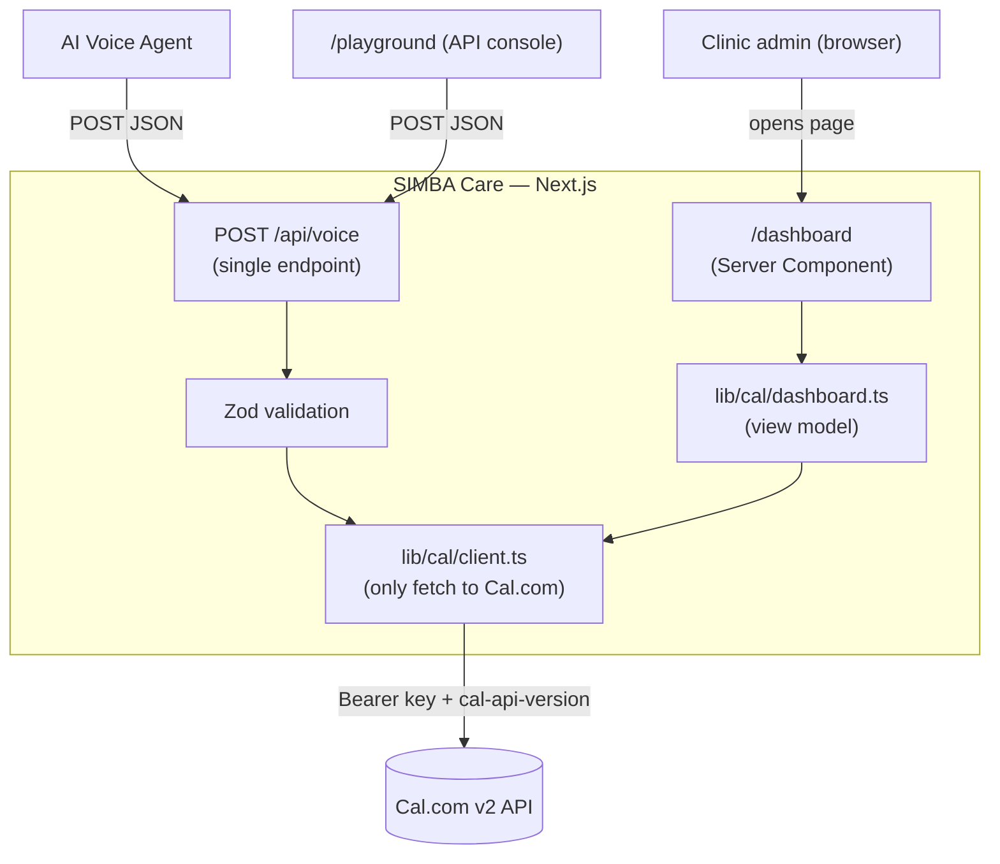
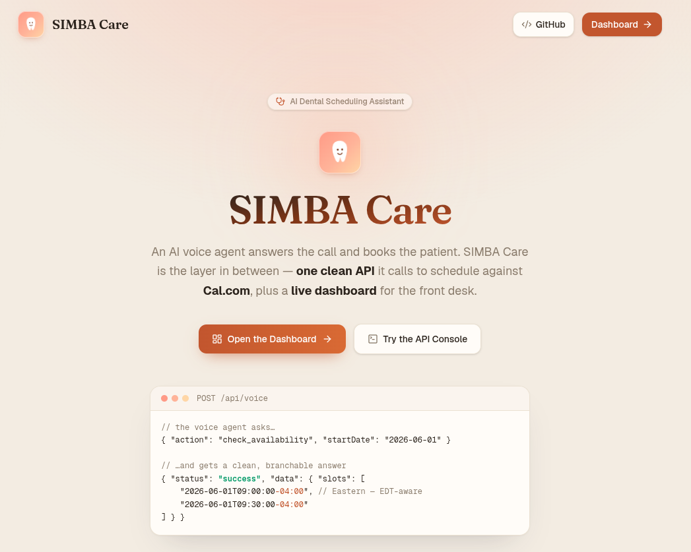
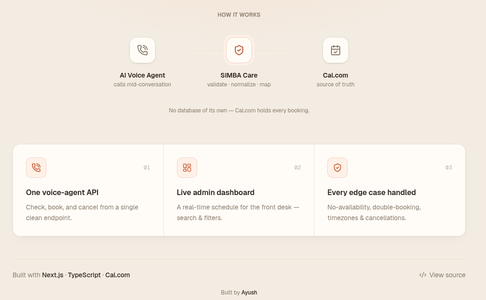
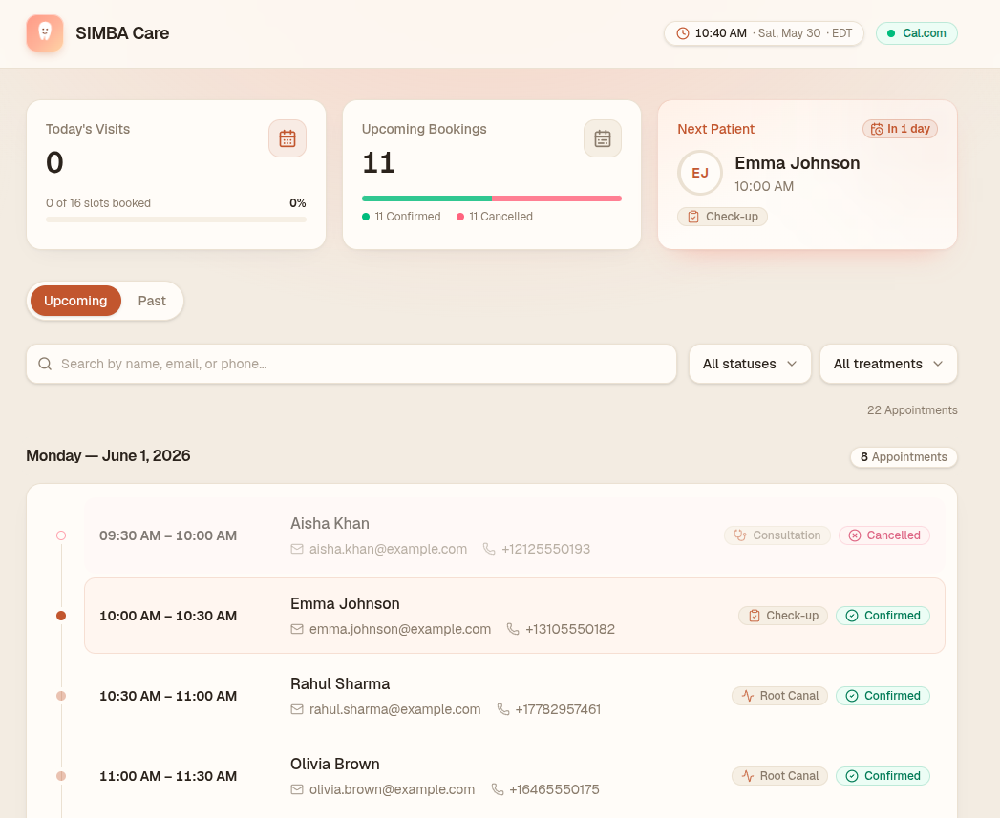
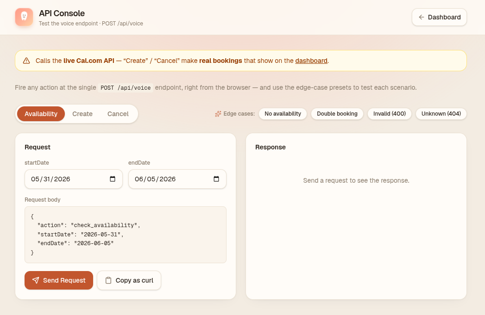
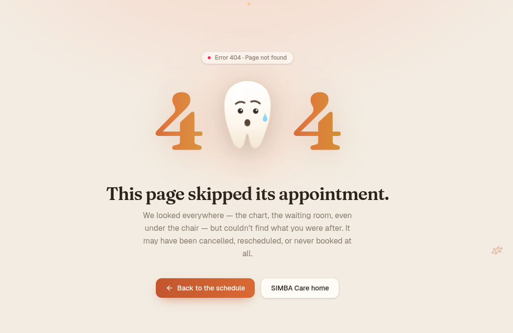

# 🦷 SIMBA Care — AI Dental Scheduling Assistant

A dental practice wants an AI voice agent that answers calls and books patients.

SIMBA Care is the piece that sits **between that agent and Cal.com**:

- It exposes **one API route** (`POST /api/voice`) the agent calls to _check availability → book → cancel_, with clean JSON responses the agent can act on without parsing prose.

- It renders a **live admin dashboard** (`/dashboard`) so staff can watch bookings come in.

- It owns **no database**. Cal.com is the single source of truth. SIMBA Care is a stateless validation + transformation + presentation layer.

- Our app's job is to:
  - (a) give the voice agent a clean JSON contract to book against.
  - (b) give staff a live dashboard to watch those bookings.

Technically, it's a **Next.js** app: a backend that an **AI voice agent calls mid-conversation** to check availability, book, and cancel dental appointments against the **Cal.com** API, a polished read-only **admin dashboard** for front-desk staff, an interactive **API console** for reviewers to test it, and a clean **landing page** tying it all together.

### Demo video

<!-- Replace VIDEO_ID with your YouTube video id (the part after watch?v= or youtu.be/) -->

[](https://youtu.be/VIDEO_ID)

<!-- [](https://youtu.be/txg8oxQykac) -->

> _Click the thumbnail to watch the walkthrough._

## Table of Contents

- [Features](#features)
- [Tech stack](#tech-stack)
- [Directory Structure](#directory-structure)
- [How it Works (Architecture)](#how-it-works-architecture)
- [Frontend UI](#frontend-ui)
- [Cal.com Integration](#calcom-integration)
- [Clone, Setup & Run locally](#clone-setup--run-locally)
- [Assumptions & Scope](#assumptions--scope)
- [Contributing](#contributing)

## Features

| Area           | Feature             | Details                                                                                                                        |
| -------------- | ------------------- | ------------------------------------------------------------------------------------------------------------------------------ |
| **API**        | Single route        | One `POST /api/voice` handler switches on `action` — `check_availability`, `create_booking`, `cancel_booking`.                 |
| **API**        | Consistent envelope | Every response is `{ status, message?, data? }` where `status ∈ success \| error \| unavailable \| conflict`.                  |
| **API**        | Input validation    | Every payload is validated with **Zod** before any upstream call; bad input → clean `400`.                                     |
| **Edge case**  | No availability     | Returns `200 { status: "unavailable", data.alternativeSlots }` (looks ahead up to 7 days) — never an error.                    |
| **Edge case**  | Double booking      | Cal.com conflict is caught → `200 { status: "conflict" }` so the agent pivots mid-call.                                        |
| **Edge case**  | Timezones           | Computes in **UTC**, converts to `America/New_York` only at the edges; **EST/EDT handled** by `date-fns-tz` (never hardcoded). |
| **Edge case**  | Cancellation        | Cancels in Cal.com (frees the slot) and shows the booking as a **cancelled ghost card** on the dashboard.                      |
| **Resilience** | Safe upstream calls | 10s timeout + try/catch on every Cal.com call; `429`/timeout/5xx mapped to clean messages; **API key never leaked**.           |
| **Dashboard**  | Live snapshot       | Today's visits (capacity meter), upcoming bookings (confirmed/cancelled split), next-patient card with live countdown.         |
| **Dashboard**  | Timeline feed       | Bookings grouped by day on a timeline spine, a live **"now" marker**, today highlighted, sticky day headers.                   |
| **Dashboard**  | Upcoming / Past     | Tabs to browse history (last 15 → 30 → 90 → 365 days, on demand).                                                              |
| **Dashboard**  | Search & filters    | Instant search by name / email / phone + filter by status and treatment.                                                       |
| **Playground** | API console         | `/playground` — fire every action + edge case from the browser, no curl or voice agent needed.                                 |
| **Landing**    | Home page           | A polished `/` landing page that frames the project and routes into the dashboard and the API console.                         |
| **Quality**    | Tested              | 62 unit/route tests (timezone, transforms, filters, schemas, every route branch).                                              |

## Tech stack

| Layer             | Choice                                               |
| ----------------- | ---------------------------------------------------- |
| Framework         | **Next.js 16** (App Router, React Server Components) |
| Language          | **TypeScript**                                       |
| Validation        | **Zod**                                              |
| Dates / timezones | **date-fns** + **date-fns-tz**                       |
| Styling           | **Tailwind CSS v4**                                  |
| Testing           | **Vitest**                                           |
| Hosting           | **Vercel**                                           |

## Directory structure

```
app/
  api/voice/route.ts      # THE single voice-agent endpoint (POST, switches on action)
  dashboard/              # admin UI: page.tsx + loading.tsx + error.tsx
  playground/             # interactive API console (page.tsx)
  page.tsx                # landing / home page
  not-found.tsx           # creative 404
  globals.css             # the only stylesheet (design tokens + keyframes)
components/
  ui/                     # primitives: card, badge
  dashboard/              # composed feature components (header, stat-card, booking-card, day-group, …)
  playground/             # api-console.tsx
lib/
  cal/
    client.ts             # the ONLY place that fetch()es Cal.com (timeout + error mapping)
    types.ts              # Cal.com request/response types
    transforms.ts         # flatten slots, group bookings, parse treatment/phone
    dashboard.ts          # assembles the dashboard + past-bookings view models
  schemas.ts              # Zod schemas for the voice payloads
  time.ts                 # ALL timezone logic (date-fns-tz)
  filter-bookings.ts      # pure search/filter logic (unit-tested)
  constants.ts            # CLINIC_TZ, CLINIC_HOURS, API versions, past windows
  env.ts                  # validated env access (fail fast on boot)
types/index.ts            # shared app types (ApiResponse, BookingView, …)
tests/                    # vitest: time, transforms, schemas, route, filters
requests.http             # manual API checks for each action + edge case
```

**The rule that keeps it clean:**

- only `lib/cal/client.ts` ever calls `fetch()` to Cal.com, and only `lib/time.ts` does timezone math. Everything else speaks to those through typed functions.

## How it Works (Architecture)

SIMBA Care has **two entry points** (the voice agent's API call and the admin's browser) that funnel through **one Cal.com client**.



### Flow 1 — Voice agent books an Appointment

1. Agent sends `POST /api/voice` with a JSON body containing an `action`.

2. The body is **parsed safely** and **validated with Zod** (also enforces a known action). Bad input → `400 { status: "error", message }`.

3. The handler dispatches on `action` and calls `lib/cal/client.ts`, which adds the `Bearer` key + per-endpoint `cal-api-version` header, applies a timeout, and returns a typed result (never throws, never leaks the key).

4. The result is mapped to the **common envelope** and returned. The agent reads `status` to decide what to say next.

| `action`             | Request (in)                            | Response (out)                                                           |
| -------------------- | --------------------------------------- | ------------------------------------------------------------------------ |
| `check_availability` | `{ startDate, endDate }` (`YYYY-MM-DD`) | `success` + `data.slots[]`, or `unavailable` + `data.alternativeSlots[]` |
| `create_booking`     | `{ start, name, email, number, notes }` | `success` + `data.bookingId`, or `conflict`                              |
| `cancel_booking`     | `{ bookingId, reason }`                 | `success` (slot freed)                                                   |

> Open `GET /api/voice` in a browser to get a self-documenting list of the actions and payload shapes.

### Flow 2 — Admin dashboard shows Bookings

1. The browser requests `/dashboard` (a **Server Component**, re-rendered fresh on each load).
2. `lib/cal/dashboard.ts` fires two parallel Cal.com reads — `status=upcoming` and `status=cancelled` — so just-cancelled bookings still appear.
3. `lib/cal/transforms.ts` reshapes Cal.com's nested response into a clean `BookingView`, parses the treatment type, and groups bookings by clinic-local day.
4. HTML is streamed to the browser; small client islands hydrate the live bits (clock, countdown, search/filter, auto-refresh).

> **Where the data lives:** nowhere in our app. Cal.com holds every booking; SIMBA Care just validates, reshapes, and presents it.

### Edge cases

| Case                    | Behaviour                                                                                                                                                                 |
| ----------------------- | ------------------------------------------------------------------------------------------------------------------------------------------------------------------------- |
| **No availability**     | `200 { status: "unavailable", data.alternativeSlots }`. Looks ahead up to 7 days from the next calendar day.                                                              |
| **Double booking**      | Cal.com conflict caught → `200 { status: "conflict", message: "That slot was just taken…" }`.                                                                             |
| **Timezones**           | UTC internally; convert to `America/New_York` only at the edges. `date-fns-tz` handles EST (`-05:00`) vs EDT (`-04:00`). Naive inbound times are treated as clinic-local. |
| **Cancellation**        | Frees the slot in Cal.com and re-renders the booking as a cancelled ghost card (not silently gone).                                                                       |
| **Upstream resilience** | 10s timeout + try/catch; `429 → "busy, try again"`, timeout → `504`, network/5xx → `502`; key never leaked.                                                               |

> Try them all without a voice agent: [`requests.http`](./requests.http) or the [Playground](#frontend-ui).

## Frontend UI

> 📸 Screenshots live in [`docs/screenshots/`](./docs/screenshots).

### `/` — Landing page

A polished home page that frames the project in five seconds — an animated tooth mascot, a live **request → response snippet** of the API, a "how it works" flow, and clear routes into the dashboard and the API console. Same warm theme as the rest of the app, fully responsive.





### `/dashboard` — admin dashboard



Read-only, server-rendered, auto-refreshing. What staff see:

- **Header** — clickable `SIMBA Care` wordmark (→ home), a live **clinic clock** (ET), and a `● Cal.com` sync badge (green = live, red = unreachable).

- **Metrics strip** — _Today's Visits_ (with a capacity meter), _Upcoming Bookings_ (with a confirmed/cancelled split bar), and a **Next Patient** card with a monogram and a live "in X mins" countdown.

- **Timeline feed** — appointments grouped by day on a vertical timeline; today is highlighted and carries a live **"now" marker**; each row shows the time range, patient name/email/phone, a **treatment badge** (Root Canal, Cleaning, Extraction, …), and a **status badge** (`Confirmed` / `Cancelled`).

- **Upcoming / Past tabs** — browse history in rolling windows (last 15 → 30 → 90 → 365 days).

- **Search & filters** — instant search by name / email / phone, plus status and treatment filters.

- **Empty state** — _"The clinic schedule is clear."_
- Fully responsive (mobile / iPad / desktop). Warm, clinical light theme built on CSS-variable tokens, so re-theming is a one-file change.

### `/playground` — API Console (why it exists)

> A browser UI to **exercise the entire `/api/voice` contract without curl or a real voice agent**.



The motive: a reviewer shouldn't need a phone, an AI agent, or the terminal to confirm the API works. Every action and edge case is clickable:

- Forms for all three actions, pre-filled with valid examples.

- **One-click edge-case presets** — no availability, double booking, invalid payload (`400`), unknown booking (`404`).

- **Status-colored responses** with HTTP code + latency, so you _see_ the envelope branching.

- **Chained flow** — run availability → click a returned slot → it loads into _Create_ → on success the `bookingId` auto-fills _Cancel_.

- **Copy as curl** for any request.

> ⚠️ It calls the **live** Cal.com API — _Create_ / _Cancel_ make real bookings (which then show up on `/dashboard`). That's intentional: it's a true end-to-end demo.

### Custom 404 page

Any unknown route renders a creative, on-brand 404 — a "lost tooth" mascot (the same Fraunces display type as the wordmark) with a route back to the dashboard.



## Cal.com Integration

All upstream calls go through `lib/cal/client.ts` using standard `fetch` with:

- `Authorization: Bearer <CAL_API_KEY>`.

- `cal-api-version: <version>` — **pinned per endpoint** (slots `2024-09-04`, bookings `2024-08-13`) in `lib/constants.ts`.

### Environment Variables

| Variable            | Required | Example                  | Notes                                                                  |
| ------------------- | -------- | ------------------------ | ---------------------------------------------------------------------- |
| `CAL_API_KEY`       | ✅       | `cal_live_…`             | Cal.com API key (Bearer auth). Server-only — never sent to the client. |
| `CAL_EVENT_TYPE_ID` | ✅       | `5844672`                | Numeric event-type id for the appointment.                             |
| `CAL_TIMEZONE`      | –        | `America/New_York`       | Clinic IANA timezone (default shown).                                  |
| `CAL_API_URL`       | –        | `https://api.cal.com/v2` | Cal.com v2 base URL (default shown).                                   |

Env is validated with Zod on boot (`lib/env.ts`) — the app **fails fast** with a readable message if anything is missing, instead of 500-ing on the first request.

> **One-time Cal.com Setup:** the event type must have an **availability schedule** attached (e.g. Mon–Fri 9–5).

## Clone, Setup & Run Locally

### Prerequisites

- **Node.js 20+** and npm

- A **Cal.com** account with an API key and an event type ([cal.com/docs](https://cal.com/docs/api-reference/v2/introduction))

### 1. Clone

```bash
git clone https://github.com/ayushkcs/simba-care.git
cd simba-care
```

### 2. Configure environment

```bash
cp .env.example .env.local
```

Open `.env.local` and fill in your Cal.com values (see the [env table](#environment-variables)):

```bash
CAL_API_KEY="cal_live_xxxxxxxxxxxxxxxxxxxxxxxx"
CAL_EVENT_TYPE_ID="5844672"
CAL_TIMEZONE="America/New_York"
CAL_API_URL="https://api.cal.com/v2"
```

> `.env.local` is gitignored — your real key never gets committed.

### 3. Install & run

```bash
npm install
npm run dev
```

Open **http://localhost:3000** for the landing page. The dashboard is at **/dashboard** and the API console at **/playground**.

### Available Scripts

| Script               | What it does                                 |
| -------------------- | -------------------------------------------- |
| `npm run dev`        | Start the dev server (http://localhost:3000) |
| `npm run build`      | Production build                             |
| `npm start`          | Serve the production build                   |
| `npm test`           | Run the test suite (Vitest)                  |
| `npm run test:watch` | Run tests in watch mode                      |
| `npm run lint`       | Lint with ESLint                             |
| `npm run format`     | Format with Prettier                         |

### 4. Deploy (Vercel)

1. Push the repo to GitHub.

2. Import it in **Vercel** (Next.js is auto-detected).

3. Add the env vars under **Project → Settings → Environment Variables**.

4. Deploy. The endpoint is live at `https://<your-app>.vercel.app/api/voice`, the dashboard at `/dashboard`.

## Assumptions & Scope

Decisions made while building, so the scope is explicit:

| Assumption                                    | Detail                                                                                                                                          |
| --------------------------------------------- | ----------------------------------------------------------------------------------------------------------------------------------------------- |
| **No audio / telephony layer**                | The voice agent (STT/TTS/call handling) is out of scope. SIMBA Care builds the **HTTP + JSON contract** that agent would call mid-conversation. |
| **One shared event type**                     | All visits map to a single Cal.com event type; the **treatment type is inferred from the booking notes** (regex), not separate event types.     |
| **Clinic hours = 9 AM–5 PM ET, 30-min slots** | Not specified in the brief — assumed, and used for slot filtering and the capacity meter (16 slots/day).                                        |
| **Single clinic / timezone / calendar**       | One location, `America/New_York`, one calendar — no multi-provider or multi-location support.                                                   |
| **No authentication**                         | The dashboard is public and read-only, per the brief ("no auth logic"). Anyone with the URL can view it.                                        |
| **Cal.com enforces slot uniqueness**          | Double-booking prevention relies on Cal.com rejecting conflicts; we surface that as `status: "conflict"`.                                       |
| **Naive timestamps are clinic-local**         | A booking time with no offset is interpreted as `America/New_York`.                                                                             |
| **Phone defaults to US (+1)**                 | Numbers without a country code are normalized to `+1`.                                                                                          |
| **"Live" = polling**                          | The dashboard auto-refreshes (`router.refresh`) rather than subscribing to Cal.com webhooks.                                                    |
| **Past view is bounded**                      | Rolling windows of 15 / 30 / 90 / 365 days, capped at 100 records per status (truncation is surfaced, not silent).                              |
| **en-US locale**                              | Dates, times, and copy assume US English.                                                                                                       |

## Contributing

Contributions are welcome.

1. **Fork** the repo and create a branch: `git checkout -b feature/your-feature`.

2. Make your change. Keep the architecture intact — Cal.com calls stay in `lib/cal/client.ts`, timezone logic stays in `lib/time.ts`.

3. Before opening a PR, make sure all gates pass:
   ```bash
   npm run lint
   npm test
   npm run build
   ```
4. Run `npm run format` so the diff stays clean.
5. Open a **pull request** with a clear description of what changed and why.

## Ideas for "What's Next"

- **Auth** on the dashboard (currently open) — shared-password or SSO for staff.

- **Webhooks** from Cal.com → revalidate the dashboard instantly instead of polling.

- **Reschedule** action + retry/backoff on `429`.

- **Server-side search** with pagination for large histories.

- Map treatment type to a dedicated Cal.com field instead of parsing notes.

---

<p align="center">
  Built by <strong><a href="https://ayushk.blog">Ayush</a></strong> ✦ <a href="https://www.linkedin.com/in/ayushkcs/">LinkedIn</a> ✦ <a href="https://x.com/ayushkcs/">X</a> ✦ <a href="mailto:kayush2k02@gmail.com">Email</a>
</p>
